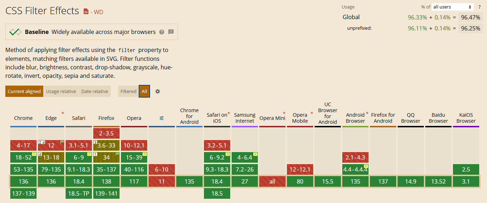
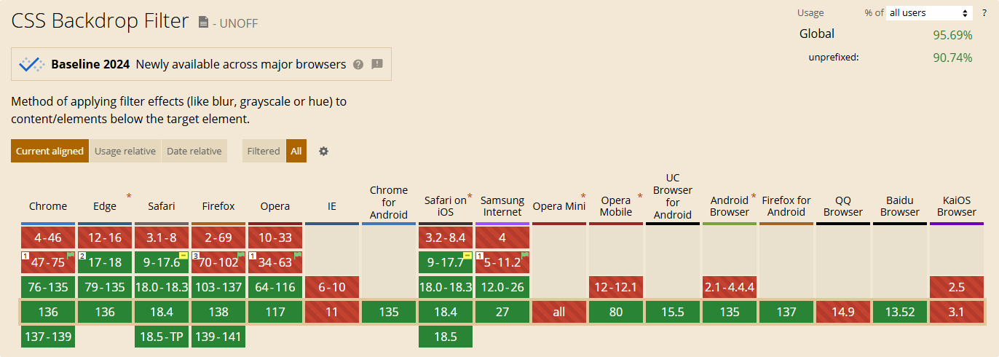

# CSS 踩坑经历和经验总结 FAQ

## Q: 为什么本体设置 `filter: blur();` 会有白边，但是用一个带有 `backdrop-filter: blur();` 的遮罩层实现相同效果时，不会有白边？

### **A:** 使用 `filter: blur();` 和 `backdrop-filter: blur();` 时出现的边缘差异，主要与它们的渲染机制和盒模型处理方式有关。

::: warning 注意

这个问题后续的回答，深色模式可能会影响展示效果，建议关闭。

:::

**核心原因：渲染区域不同**

- `filter: blur();`：
  
  会对元素的整个渲染区域（包括内容、内边距、边框）应用模糊，**但不包括外边距**。模糊效果会超出元素边界，但超出部分会被父容器的 `overflow: hidden` 裁剪，导致边缘出现 “白边” 或不自然的过渡。

- `backdrop-filter: blur();`：
  
  只对元素背后的区域（即透过元素可见的背景）应用模糊，即只处理背景区域，不影响元素本身的渲染区域。因此，即使父容器有裁剪，也不会影响模糊效果的完整性。

**效果差异：**

- `filter: blur();`：模糊效果在容器边缘被裁剪，导致颜色突变（白边）。
- `backdrop-filter: blur();`：模糊效果应用于容器背后的区域，边缘自然过渡，无白边。

<style>
  .test-container {
    width: 200px;
    height: 200px;
    overflow: hidden;
    border: 1px solid black;

    position: relative;  /* 遮罩定位 */
  }

  .test-container > .image {
    width: 100%;
    height: 100%;
    background-image: url('https://picsum.photos/200/200');
    background-size: cover;
  }
  
  /* 使用 filter: blur 的元素 */
  .filter-blur {
    filter: blur(10px);
  }
  
  /* 使用 backdrop-filter 的元素 */
  .backdrop-filter-blur {
    width: 100%;
    height: 100%;
    backdrop-filter: blur(10px);
    -webkit-backdrop-filter: blur(10px); /* 浏览器兼容性 */

    /* 遮罩定位 */
    position: absolute;
    top: 0;
    left: 0;
  }
</style>

**filter-blur：**
<div class="test-container">
  <div class="image filter-blur"></div>
</div>

**backdrop-filter-blur：**
<div class="test-container">
  <div class="image"></div>
  <div class="backdrop-filter-blur"></div>
</div>

效果展示代码：

@[code{37-82} html:no-line-numbers {20,27-28}](./FAQ.md)

### ✅解决方案

#### **方案 A：扩大模糊元素尺寸**

通过增大模糊元素的尺寸，使被裁剪的部分位于视觉范围之外：

::: warning 注意

该方案会导致元素的尺寸增加（文字被放大）、内容无法完全显示（图片边缘被裁切）等问题，可能会影响布局。

:::

<style>
  .filter-blur-2 {
    width: calc(100% + 20px) !important;
    height: calc(100% + 20px) !important;
    filter: blur(10px);
    position: absolute;
    top: -10px;
    left: -10px;
  }
</style>

**filter-blur（裁剪前）：**
<div class="test-container" style="overflow: visible;">
  <div class="image filter-blur-2"></div>
</div>

**filter-blur（裁剪后）：**
<div class="test-container">
  <div class="image filter-blur-2"></div>
</div>

```html:no-line-numbers {6-7}
<style>
  .test-container {
    width: 200px;
    height: 200px;
    border: 1px solid black;
    overflow: hidden; /* 裁剪溢出部分 */
    position: relative; /* 偏移定位 */ 
  }

  .test-container > .image {
    width: 100%;
    height: 100%;
    background-image: url('https://picsum.photos/200/200');
    background-size: cover;
  }

  .filter-blur {
    filter: blur(10px);
    width: calc(100% + 20px) !important; /* 增加20px以覆盖模糊溢出 */ // [!code ++]
    height: calc(100% + 20px) !important; /* 溢出数值是blur()值的2倍 10px * 2 = 20px */ // [!code ++]
    /* 偏移定位 */ // [!code ++]
    position: absolute; // [!code ++]
    top: -10px; // [!code ++]
    left: -10px; // [!code ++]
  }
</style>

<div class="test-container">
  <div class="image filter-blur"></div>
</div>
```

::: tip 提示

因为该方案是通过放大元素后裁切，所以不仅可以通过增加 `width` 和 `height` 来实现，还可以通过放大 `background-size` 或使用 `transform: scale();` 进行放大来实现该方案。

:::

#### **方案 B：使用 backdrop-filter（推荐）**

直接对背景应用模糊，避免裁剪问题：

**backdrop-filter-blur：**
<div class="test-container">
  <div class="image"></div>
  <div class="backdrop-filter-blur"></div>
</div>

```html:no-line-numbers {7,10-15,22-33}
<style>
  .test-container {
    width: 200px;
    height: 200px;
    overflow: hidden;
    border: 1px solid black;
    position: relative;  /* 遮罩定位 */
  }

  .test-container > .image {
    width: 100%;
    height: 100%;
    background-image: url('https://picsum.photos/200/200');
    background-size: cover;
  }

  /* 移除原有的 filter 滤镜 */
  /* .filter-blur {
    filter: blur(10px);
  } */

  /* 添加新的 backdrop-filter 遮罩滤镜 */
  .backdrop-filter-blur {
    width: 100%;
    height: 100%;
    backdrop-filter: blur(10px);
    -webkit-backdrop-filter: blur(10px); /* 浏览器兼容性 */

    /* 遮罩定位 */
    position: absolute;
    top: 0;
    left: 0;
  }
</style>

<div class="test-container">
  <div class="image"></div>
  <div class="backdrop-filter-blur"></div>
</div>
```

::: tip 提示

上面通过添加新的遮罩元素来实现模糊效果，可能会导致 HTML 结构变复杂。当然，也可以通过 CSS 伪元素 `::before` 或 `::after` 来实现，以化简 HTML 结构。

```html:no-line-numbers {7,17-29}
<style>
  .test-container {
    width: 200px;
    height: 200px;
    overflow: hidden;
    border: 1px solid black;
    position: relative;  /* 遮罩定位 */
  }

  .test-container > .image {
    width: 100%;
    height: 100%;
    background-image: url('https://picsum.photos/200/200');
    background-size: cover;
  }

  /* 添加伪元素遮罩层 */
  .test-container > .image::after {
    content: '';
    width: 100%;
    height: 100%;
    backdrop-filter: blur(10px);
    -webkit-backdrop-filter: blur(10px); /* 浏览器兼容性 */

    /* 遮罩定位（伪元素同样需要定位） */
    position: absolute;
    top: 0;
    left: 0;
  }
</style>

<div class="test-container">
  <div class="image"></div>
</div>
```

:::

**与直接应用 backdrop-filter 的对比：**
|    方法    |            优点	           |         缺点         |
| :--------: | :-------------------------: | :------------------: |
|  直接应用  |       代码简单，结构清晰     | 可能影响元素内部布局 |
| 伪元素实现 | 保持 HTML 干净，分离视觉效果 |    层级管理较复杂    |

### 📈性能与兼容性

- `filter`：兼容性好，但性能开销大（尤其是含有动画时），且需要额外处理边缘问题。
- `backdrop-filter`：性能优于 `filter`，因为只处理背景区域。但兼容性较差，需要添加 `-webkit-` 前缀，且会导致页面结构复杂度增加。

|           属性	          |    渲染区域    | 边缘问题	| 性能 | 兼容性 |
| :-----------------------: | :------------: | :-----: | :---: | :----: |
|      `filter: blur()`     |    元素整体    |  有白边  |  低  |   好   |
| `backdrop-filter: blur()` | 元素背后的背景 |  无白边  |  高  |  一般  |



[Can I use filter? - filter 滤镜兼容性](https://caniuse.com/?search=filter)



[Can I use backdrop-filter? - backdrop-filter 遮罩滤镜兼容性](https://caniuse.com/?search=backdrop-filter)

### 【提问时间：2025-05-10】 - 【更新时间：2025-05-11】