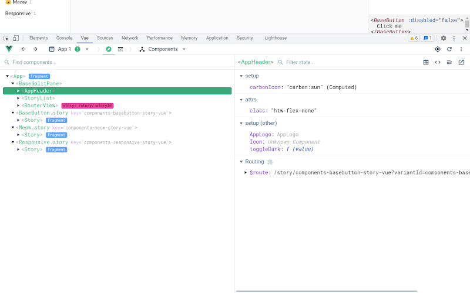

# Vue 安装

## 版本说明

> [!tip]
>
> 如果你是刚刚接触 Vue 的开发者，面对繁杂的版本号不知如何挑选的时候，请优先关注下表中 <mark>黄色高亮的部分</mark> 。在初次开发的时候，选择 **最新/指定** 的 **开发版本** 即可。
> 

<table border=1>
  <caption>版本号</caption>
  <thead align="center">
    <tr>
      <th>主版本号</th>
      <th colspan=2>精确版本号</th>
      <th colspan=1>最高版本号</th>
    </tr>
    <tr>
      <th >Vue 版本</th>
      <th>Git 标签风格</th>
      <th colspan=2>包管理器风格</th>
    </tr>
  </thead>
  <tbody align="center">
    <tr>
      <td style="background: yellow;">Vue 2</td>
      <td>v2.x.x</td>
      <td style="background: yellow;">vue@2.x.x</td>
      <td>vue@2</td>
    </tr>
    <tr>
      <td style="background: yellow;">Vue 3</td>
      <td>v3.x.x</td>
      <td style="background: yellow;">vue@3.x.x</td>
      <td>vue@3</td>
    </tr>
  </tbody>
  <tfoot>
    <tr>
      <td colspan=4 align="left" style="font-size: 0.8rem;">
        <span>注：</span>
        <ol>
          <li>表格里面的 <code>x.x.x</code> 代表的是版本数。例如：<code>3.5.13</code> ， <code>2.7.16</code> 。</li>
          <li>Git 标签风格中常常还能看到有 <code>-rc</code> 后缀的，这指的是功能完备、待测试的预发布版本（Release Candidate）例如：<code>v3.5.0-rc.1</code> 。</li>
          <li>包管理器风格的版本号，即 <code>npm install</code> 或 <code>yarn add</code> 时使用的版本号。写法是基于 <a target="_blank" href="https://semver.org/lang/zh-CN/">SemVer 语义化版本</a>的版本范围语法，适用于 npm、yarn、pnpm 等包管理器。</li>
          <li>最高版本号，指的是在主版本号下的最新版本。例如：<code>vue@3</code> 指的是 <code>v3.5.13</code> 版本（在本文编写时，vue 的最新版本是 v3.5.13）。</li>
        </ol>
      </td>
    </tr>
  </tfoot>
</table>

<table border=1>
  <caption>版本类型</caption>
  <thead align="center">
    <tr>
      <th rowspan=2>版本类型</th>
      <th colspan=2>不同版本的文件名</th>
      <th rowspan=2>类型说明</th>
    </tr>
    <tr>
      <th>Vue 2</th>
      <th>Vue 3</th>
    </tr>
  </thead>
  <tbody align="center">
    <tr style="background: yellow;">
      <td>开发版本</td>
      <td><code>vue.js</code></td>
      <td><code>vue.global.js</code></td>
      <td style="font-size: 0.8rem;">包含完整的警告和调试模式，适合开发环境</td>
    </tr>
    <tr style="background: yellow;">
      <td>生产版本</td>
      <td><code>vue.min.js</code></td>
      <td><code>vue.prod.js</code></td>
      <td style="font-size: 0.75rem;">删除了警告，并将代码压缩，减小了体积，适合生产环境</td>
    </tr>
  </tbody>
  <thead align="center">
    <tr>
      <th rowspan=2>其他版本类型</th>
      <th colspan=2>文件名</th>
      <th rowspan=2>类型说明</th>
    </tr>
    <tr>
      <th colspan=2>（会和上面版本类型搭配使用）</th>
    </tr>
  </thead>
  <tbody align="center">
    <tr>
      <td>CommonJS 模块化版本</td>
      <td colspan=2><code>.cjs</code></td>
      <td style="font-size: 0.9rem;">适用于 Node.js 环境</td>
    </tr>
    <tr>
      <td>运行时构建版本</td>
      <td colspan=2><code>.runtime</code></td>
      <td style="font-size: 0.7rem;">此版本不包含模板编译器，因此不支持在客户端编译模板。适用于已经通过构建工具（如 webpack 或 Vite）预先编译模板的应用</td>
    </tr>
    <tr>
      <td>适用于浏览器的 ES 模块化版本</td>
      <td colspan=2><code>.esm-browser</code></td>
      <td style="font-size: 0.7rem;">此版本使用原生 ES 模块语法，适合现代浏览器，支持通过 <code>&ltscript type="module"&gt</code> 标签直接在浏览器中引入</td>
    </tr>
    <tr>
      <td>适用于打包工具的 ES 模块构建版本</td>
      <td colspan=2><code>.esm-bundler</code></td>
      <td style="font-size: 0.7rem;">此版本设计为可被静态分析，支持 tree-shaking，以便打包工具（如 webpack 2 或 Rollup）优化最终的包体积。</td>
    </tr>
  </tbody>
  <tfoot>
    <tr>
      <td colspan=4 align="left" style="font-size: 0.8rem;">
      </td>
    </tr>
  </tfoot>
</table>

### 示例说明

- `vue@3.5.13/dist/vue.global.js` 是全局构建版本的 Vue 3.5.13 版本。
- `vue/3.2.10/vue.esm-browser.min.js` 是适用于浏览器的 ES 模块化版本的 Vue 3.2.10 版本。

## 通过 CDN 下载

> CDN (Content Delivery Network) 即内容分发网络，通过在网络上提供一系列的缓存版本的资源文件，来加速网站的访问速度。

::: code-tabs

@tab Unpkg
```shell:no-line-numbers
https://unpkg.com/vue@3/dist/vue.global.js
```

@tab JSDelivr
```shell:no-line-numbers
https://cdn.jsdelivr.net/npm/vue@3/dist/vue.global.js
```

@tab CDNJS
```shell:no-line-numbers
https://cdnjs.cloudflare.com/ajax/libs/vue/3.5.13/vue.global.js
```

:::

> [!tip]
>
> 由于国内的网络环境问题，这些 CDN 有时候并没有办法流畅访问。
>
> 所以我们建议将 Vue 下载到本地后再进行学习。
>

## 通过 **`<script>` 标签** 进行引入

```html:no-line-numbers
<script src="./vue.global.js"></script>
```

::: tip

我们推荐刚刚接触 Vue 的开发者通过 `<script>` 标签的方式引入 Vue，这样可以快速上手。

等我们熟悉 Vue 的基础语法和 API 后，会再返回来学习使用 **命令行工具** 进行安装。

所以，我们可以先 **跳过** 命令行工具的部分，继续进行[后面](#安装-vuedevtools)的学习。

:::

## 使用 **命令行工具** 进行安装

```bash:no-line-numbers
// 安装 Vue CLI
npm install -g @vue/cli

// 创建一个新项目
vue create [my-project]

// 启动项目
cd [my-project]
npm run serve
```

## 安装 VueDevTools

VueDevTools 是 Vue 官方提供的浏览器插件，它可以帮助我们更好地调试 Vue 应用。



- [VueDevTools - Chrome 网上应用店](https://chrome.google.com/webstore/detail/vuejs-devtools/nhdogjmejiglipccpnnnanhbledajbpd)
- [VueDevTools - Firefox 附加组件](https://addons.mozilla.org/zh-CN/firefox/addon/vue-js-devtools/)
- [VueDevTools - Edge 应用商店](https://microsoftedge.microsoft.com/addons/detail/vuejs-devtools/olofadcdnkkjdfgjcmjaadnlehnnihnl)

::: warning

Edge 和 Firefox 版本的 VueDevTools 插件更新速度会比较慢，建议使用 Chrome 版本的插件。

:::

## 参考

- [快速上手 | Vue.js](https://cn.vuejs.org/guide/quick-start)
- [搭建 Vue 开发环境 - bilibili](https://www.bilibili.com/video/BV1Zy4y1K7SH?&p=4)