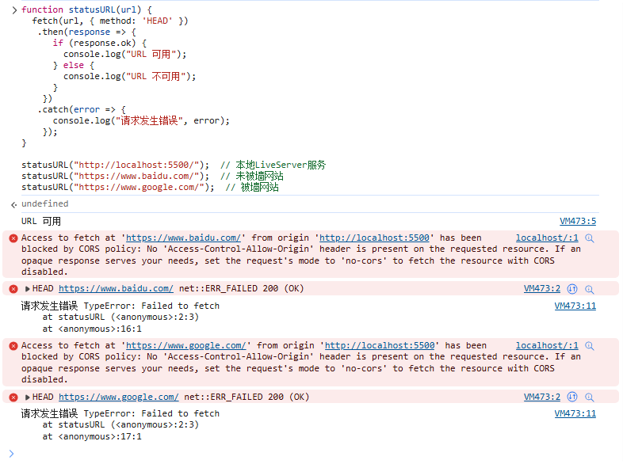

# JS实现纯前端检测网址可用性(可跨域CORS)

前段时间在完善自己的导航网页，因为里面有很多资源是临时或国外的，而且不会主动去检测已有链接的可用性 ~~（因为懒）~~ ，所以想写个JS用来帮助我检测，以便发现失效并及时更新。

但，是写前端还是后端呢？上网搜了搜类似案例，大多都是后端的，而且有详细的讲解。好！那就写后端吧，简单 ~~（有的抄）~~ ，就嘎嘎地写了一下，检测，更新资源，上线部署。

不久后有用户跟我说：“还是有很多(墙外)资源打不开啊。” 

我：“......不是（哭笑 ”

每个人的网络环境都各不相同，有些资源上不去也是正常，但如何让他们明白，这可能是因为他们的网络环境问题呢？

我就在想，能否在前端尝试Ping或类似的测试呢？

## 方案一：通过响应码判断 ×

前端发送网络请求，最快想到的就是 `XMLHttpRequest` 、`Ajax` 、`Fetch API` 这三兄弟了。通过发起网络请求，获取响应码，然后根据响应码判断是否可用。


### 用XMLHttpRequest发送请求

> 什么是 XMLHttpRequest (XHR)：用于与服务器交互。通过 XMLHttpRequest 可以在不刷新页面的情况下请求特定 URL，获取数据。这允许网页在不影响用户操作的情况下，更新页面的局部内容。
> 
> [XMLHttpRequest - Web API | MDN](https://developer.mozilla.org/zh-CN/docs/Web/API/XMLHttpRequest)

```javascript
function statusURL(url) {

  // 创建 XMLHttpRequest 对象
  function getXmlHttpRequest() {
    if (window.XMLHttpRequest) {
      return new XMLHttpRequest();
    } else if (window.ActiveXObject) { 
      // IE浏览器 不支持 XMLHttpRequest，但支持 ActiveXObject
      return new ActiveXObject("Microsoft.XMLHTTP");
    }
  }

  var xhr = getXmlHttpRequest();
  xhr.open("GET", url, true);    // 第三个参数true表示使用异步请求
  xhr.onreadystatechange = function () {
    if (xhr.readyState === 4) {  // 4表示表示请求已完成且响应已到达
      if (xhr.status === 200) {
        console.log("URL 可用");
      } else {
        console.log("URL 不可用");
      }
    }
  };
  
  xhr.onerror = function () {
    console.log("请求发生错误");
  };

  xhr.send();
}

statusURL("http://localhost:5500/");  // 本地LiveServer服务
statusURL("https://www.baidu.com/");  // 未被墙网站
statusURL("https://www.google.com/");  // 被墙网站
```

::: details 查看运行结果


:::

::: details **这里有一种更好的写法**

参考和修改自：[elsewhere | 用Javascript检测跨域资源(CORS)的可用性](https://devylee.github.io/post/2017/04/cors-reachability-detect-in-javascript.html)

```javascript
function statusURL(url) {
  var xhr = new ( window.ActiveXObject || XMLHttpRequest )( 'Microsoft.XMLHTTP' );
  xhr.open('HEAD', url, true);  // 只发送HEAD请求，不发送实际数据
  xhr.timeout = 3000;  // 设置超时时间
  xhr.onreadystatechange = () => {
    if (xhr.readyState == 4) {
      if ([200, 301, 302, 304, 307].includes(xhr.status)) {
        console.log("URL 可用，响应码：", xhr.status);
      } else {
        console.log("URL 不可用，响应码：", xhr.status);
      }
    }
  }
  xhr.onerror = () => {
    console.log("请求发生错误");
  }
  xhr.send();
}

statusURL("http://localhost:5500/");  // 本地LiveServer服务
statusURL("https://www.baidu.com/");  // 未被墙网站
statusURL("https://www.google.com/");  // 被墙网站
```


:::

通过测试，可以看到在向同地址的服务器发请求时，返回了200响应码，则说明该地址可用。

但是向其他地址的服务器发请求时，发现浏览器抛出了CORS跨域错误，并没能实现我们需要的效果。


- `CORS policy: No 'Access-Control-Allow-Origin'` 响应中缺少 Access-Control-Allow-Origin，浏览器阻止了该跨源请求。
- `net::ERR_FAILED 200 (OK)` 在这里表示服务器响应成功，但是浏览器拒绝了访问。

> 什么是CORS跨域：CORS 是一种由浏览器实现的安全特性，旨在防止恶意网站通过脚本访问不属于它们域的资源。基本上，它允许服务器通过在响应中设置一些 HTTP 头，明确指示哪些域可以访问该资源。
> 
> [跨源资源共享（CORS） - HTTP | MDN](https://developer.mozilla.org/zh-CN/docs/Web/HTTP/CORS)

既然 XMLHttpRequest 不能实现跨域请求，那就只能用其他方式了。

### 用Ajax发送请求

> 什么是 Ajax：即**A**synchronous **J**avascript **A**nd **X**ML（异步JavaScript和XML）是一种在 Web 应用中通过异步发送 HTTP 请求向服务器获取内容，并使用这些新内容更新页面中相关的部分，而无需重新加载整个页面的 Web 开发技术。
>
> [AJAX - MDN Web 文档术语表：Web 相关术语的定义 | MDN](https://developer.mozilla.org/zh-CN/docs/Glossary/AJAX)

::: details **需要提前引入jQuery，它封装了 XMLHttpRequest 对象的方法，使更容易使用 Ajax 技术**

```javascript:no-line-numbers
// 引入jquery
function loadjQuery(callback) {
  const script = document.createElement('script');
  script.src = 'https://cdn.bootcdn.net/ajax/libs/jquery/3.6.0/jquery.min.js';
  script.onload = () => {
    console.log('jQuery loaded');
    if (callback) {
      callback();  // 当 jQuery 加载完成后调用回调函数
    }
  };
  script.onerror = () => {
    console.error('Failed to load jQuery');
  };
  document.head.appendChild(script);  // 将<script>标签添加到<head>中
}

// 使用加载的 jQuery
loadjQuery(() => {
  // 在这里可以使用 jQuery
  $(document).ready(function () {
    console.log("jQuery is ready to use!");
  });
});
```
:::

```javascript
// 发送Ajax请求
function statusURL(url) {
  $.ajax({
    url: url,
    type: "GET",
    cache: false,
    data: "",
    success: function () {
      console.log("URL 可用");
    },
    error: function () {
      console.log("URL 不可用");
    }
  });
}

statusURL("http://localhost:5500/");  // 本地LiveServer服务
statusURL("https://www.baidu.com/");  // 未被墙网站
statusURL("https://www.google.com/");  // 被墙网站
```
::: details 查看运行结果


:::

很遗憾的是，这里的运行结果也遇到了跨域问题，因为只是将 XMLHttpRequest 用 jQuery 封装了而已。在配置中加了 `cache: false,` , 所以每次请求后面都会跟上一个时间戳，避免缓存。

经过一番收索，发现了一种 jQuery 的 Ajax 方法，在 **dataType** 是 `jsonp` 或者 `script` 的时候，似乎不会有跨域的问题。

**不过我没继续给出 jsonp 解决方案的原因是：**
1. 服务器需要支持 jsonp 协议，需要配置服务器。
   - 首先我无法对第三方服务器进行配置。
   - 而且就算可以配置，为什么不直接设置 `("Access-Control-Allow-Origin", "*")`，这样更方便。
   - [XmlHttpRequest使用及“跨域”问题解决 - 咸咸海风 - 博客园](https://www.cnblogs.com/651434092qq/p/11109199.html)
2. jsonp 在我这种测试需求时会遇到的 **parsererror** 问题，即服务器返回的数据格式不正确。  
   - 因为我去测试的网站他并不一定支持 jsonp，请求出来的大概率是 `HTML` 。
   - [解决 $.ajax 请求返回 JSONP 格式时遇到的 parsererror 问题-百度开发者中心](https://developer.baidu.com/article/details/2871645)
3. jsonp 的使用还有安全问题，比如 **XXS** 攻击。

> [!TIP]
> 虽然 jsonp 无法直接提供我们想要的功能或解决跨域问题，但是它的实现思路，似乎可以给我们带来很大的启发。
> 
> 我在这篇文章中读到：
> > JSONP之所以能够用来解决跨域方案，主要是因为 `<script>` 脚本拥有跨域能力，而JSONP正是利用这一点来实现。
> > 
> > [javascript - ajax跨域，这应该是最全的解决方案了 - 程序生涯 - SegmentFault 思否](https://segmentfault.com/a/1190000012469713)
>
> 我在想，是否还有像 `<script>` 一样的 HTML 标签可以实现跨域请求？我们后续会讲到，这也是解决我这个需求的关键。
> 
> ::: details 如果你有兴趣了解一下关于 jsonp 的知识，可以试试看这两篇文章
> 
> - [javascript - ajax跨域，这应该是最全的解决方案了 - 程序生涯 - SegmentFault 思否](https://segmentfault.com/a/1190000012469713)
> - [JSONP 跨域原理及实现 - JavaScript进阶之路 - SegmentFault 思否](https://segmentfault.com/a/1190000041946934)
>
> :::

Ajax 的方式似乎是行不通了，那我们再来看一下 Fetch API 是否可以解决跨域，并实现我的需求。

### 用Fetch API发送请求

> 什么是 Fetch API：Fetch API 是一种现代的、功能强大的网络请求工具，它允许你通过 JavaScript 异步地请求资源，而不需要使用传统的 XMLHttpRequest 对象。
>
> [Fetch API | 菜鸟教程](https://www.runoob.com/ajax/fetch-api.html)

```javascript
function statusURL(url) {
  fetch(url, { 
      method: 'HEAD',
  })
   .then(response => {
      if (response.ok) {
        console.log("URL 可用");
      } else {
        console.log("URL 不可用");
      }
    })
   .catch(error => {
      console.log("请求发生错误", error);
    });
}

statusURL("http://localhost:5500/");  // 本地LiveServer服务
statusURL("https://www.baidu.com/");  // 未被墙网站
statusURL("https://www.google.com/");  // 被墙网站
```
::: details 查看运行结果

:::

很遗憾的是 Fetch API 也遇到了跨域问题，原因依旧是浏览器默认不允许跨域请求。

## 方案二：通过图片请求判断 √

在CORS跨域问题的搜索上，我找到了另一种解决方案，就是通过图片请求判断。

```html
<!DOCTYPE>
<html>
<head>
<meta http-equiv="Content-Type" content="text/html; charset=utf-8" />
<title>JS探测网站链接</title>
</head>
<body>
<div id="url1"></div>
<br/>
<div id="url2"></div>
<script language="JavaScript">
function butt(){
  tim=1;
  setInterval("tim++",100);
  autourl1="http://www.163.com"
  autourl2="https://www.jb51.net"
  var url1=document.getElementById("url1");
  var url2=document.getElementById("url2");
  url1.innerHTML=" 测试连接:http://www.163.com,测试中..... ";
  url2.innerHTML=" 测试连接:https://www.jb51.net,测试中..... ";
}
function auto(url){
  if(tim>20) {
    document.all(url).innerHTML=" 链接超时 "
  }else{
    document.all(url).innerHTML=" 链接耗时："+tim/10+"秒 "
  }
  //b++
}
function run(){
  document.write("")
  document.write("")
}
butt()
run()
</script>
</body>
</html>
```

> [JS实现探测网站链接的方法【测试可用】_javascript技巧_脚本之家](https://www.jb51.net/article/96765.htm)

**作者 yczz** 的实现思路是：通过向服务器请求一个不存在的图片文件，然后利用服务器的错误响应，触发onerror事件，然后利用时间间隔判断是否可用。

下面我制作了一张流程图，来展示他的实现原理：


这个方法实在是太精妙了，不但可以检测可用性，还可以粗略的查看访问速度。啊，多是一件美事啊！

::: details 自己以前实现该功能的写法

很早之前写的，现在有更好的实现方式。不过还是保留在这里，可以当参考用。

```html:no-line-numbers
<div id="test" onclick="pingURL(this,'https://www.chairo.cc')">Ping My Website</div>
```

```javascript
function pingURL(obj, url) {
  var urlBox = document.getElementById(obj.id);
  var startDate = new Date();
  var startTime = startDate.getMinutes() * 60 + startDate.getSeconds() + startDate.getMilliseconds() / 1000;
  urlBox.innerHTML = `Testing...`;
}
function checkTime(obj, startTime) {
  var nowDate = new Date();
  var times = (nowDate.getMinutes()*60 + nowDate.getSeconds() + nowDate.getMilliseconds()/1000 - startTime).toFixed(2);
  if (times > 20) {
    document.getElementById(obj.id).parentNode.innerHTML = "Timeout"
  } else {
    document.getElementById(obj.id).parentNode.innerHTML = times;
  }
}
```

使用方法：

1. 将上方 javascript 代码引入，新建一个 `<div>` 标签，里面必须包含 `id` 属性和 `pingURL(this,url)` 函数
2. url 部分放入链接（包含 `http://` 或 `https://` ）并用 `'单引号'` 包裹
3. 点击该 `<div>` 标签，即可测试该链接是否可用

```html:no-line-numbers
<div id="test1" onclick="pingURL(this,'https://www.chairo.cc')">Ping www.chairo.cc</div>
<div id="test2" onclick="pingURL(this,'https://www.pixiv.net')">Ping www.pixiv.net</div>
<div id="test3" onclick="pingURL(this,'https://www.baidu.com')">Ping www.baidu.com</div>
<div id="test4" onclick="pingURL(this,'https://www.google.com')">Ping www.google.com</div>
```

运行结果：


:::

同样是向不同域名的服务器发送请求，为什么 `` 标签可以实现跨域请求，而 XMLHttpRequest 却不行？

## 参考

CORS：
- [跨源资源共享（CORS） - HTTP | MDN](https://developer.mozilla.org/zh-CN/docs/Web/HTTP/CORS)
- [elsewhere | 用Javascript检测跨域资源(CORS)的可用性](https://devylee.github.io/post/2017/04/cors-reachability-detect-in-javascript.html)
- [浏览器同源政策及其规避方法 - 阮一峰的网络日志](https://www.ruanyifeng.com/blog/2016/04/same-origin-policy.html)
- [前端 - CORS解决跨域问题 - 个人文章 - SegmentFault 思否](https://segmentfault.com/a/1190000022143487)

XMLHttpRequest：
- [XMLHttpRequest - Web API | MDN](https://developer.mozilla.org/zh-CN/docs/Web/API/XMLHttpRequest)
- ["XMLHttpRequest" | Can I use... Support tables for HTML5, CSS3, etc](https://caniuse.com/?search=XMLHttpRequest)

AJAX：
- [AJAX - MDN Web 文档术语表：Web 相关术语的定义 | MDN](https://developer.mozilla.org/zh-CN/docs/Glossary/AJAX)
- [XmlHttpRequest使用及“跨域”问题解决 - 咸咸海风 - 博客园](https://www.cnblogs.com/651434092qq/p/11109199.html)
- [解决 $.ajax 请求返回 JSONP 格式时遇到的 parsererror 问题-百度开发者中心](https://developer.baidu.com/article/details/2871645)
- [javascript - ajax跨域，这应该是最全的解决方案了 - 程序生涯 - SegmentFault 思否](https://segmentfault.com/a/1190000012469713)
- [JSONP 跨域原理及实现 - JavaScript进阶之路 - SegmentFault 思否](https://segmentfault.com/a/1190000041946934)

Fetch API：
- [Fetch API | 菜鸟教程](https://www.runoob.com/ajax/fetch-api.html)
- [使用 Fetch - Web API | MDN](https://developer.mozilla.org/zh-CN/docs/Web/API/Fetch_API/Using_Fetch)
- [Fetch API 教程 - 阮一峰的网络日志](https://www.ruanyifeng.com/blog/2020/12/fetch-tutorial.html)
- ["Fetch" | Can I use... Support tables for HTML5, CSS3, etc](https://caniuse.com/?search=Fetch)

Others：
- [JS实现探测网站链接的方法【测试可用】_javascript技巧_脚本之家](https://www.jb51.net/article/96765.htm)

## 说明

本文原发表于[B站专栏](https://www.bilibili.com/read/cv17720781)，因为一些原因删除了，现在的文章是在原文基础上进行了更新和修正，并加入了一些新的内容。

如果你想查看原始文章，请访问[这里](https://github.com/Chairowell/NekoBlog/blob/16f4f04d817b8773e2088e2e248bf793fbb060b1/src/writing/pingTest-by-js.md)。

首次编写时间：2022-07-23

首次发布时间：2022-07-24
