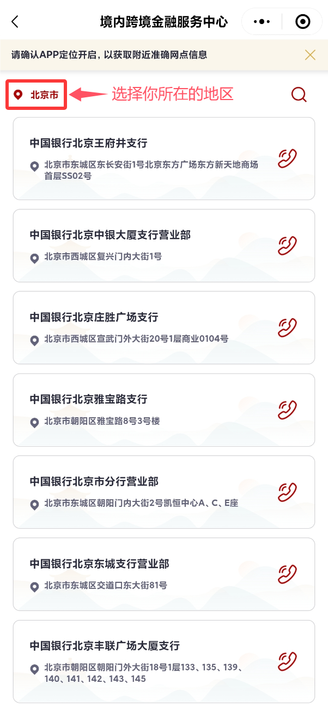

# 如何办理和使用中国银行跨境借记卡

::: warning

本文仅个人经验总结，且文章具有时效性和地区性，请以实际官方信息为准。

:::

::: note

当然，如果你也有其他办理该种银行卡的经验，或是遇到文中未被提到问题，欢迎评论区留言交流。

:::

## 起因

因为 8 月份约定和高中同学一起去日本玩，其中跨境支付是必不可少的。市面上主流的跨境支付方式，如 Visa、Mastercard、American Express、JCB 等，这些卡在大多数银行中都是和信用卡绑定办理的。但由于大学生身份的限制，没有办法办理这些信用卡。这使得我们不得不考虑其他的跨境支付方式。在通过大量的搜索和尝试后，了解到 Visa、Mastercard 还有借记卡的存在。

> 信用卡：相当于银行”借给你的钱"，花掉的下个月再还。至于银行能借你多少，取决于你的"信用"。

> 借记卡：就是你的"电子钱包"，里面必须有自己的存款才能花。存多少，取决于你的"能力"。

据我所了解到的有 **中国银行**、**中信银行** 和 **招商银行** 这几家银行可以办理跨境借记卡。

接下来我会以办理中国银行的莫奈卡（万事达 MasterCard）为例，梳理跨境借记卡的办理与使用方法，同时会记录一些踩坑的点，以便大家规避一些不必要的麻烦。

## 选择

<table>
 <colgroup>
 <col>
 <col>
 <col>
 <col>
 <col>
 <col>
 <col>
 </colgroup>
 <tbody>
 <tr>
  <td colspan="6">中国银行</td>
 </tr>
 <tr>
  <td>卡片系列</td>
  <td>卡片组织</td>
  <td>卡片种类</td>
  <td colspan="2">卡面</td>
  <td>BIN</td>
 </tr>
 <tr>
  <td rowspan="8">长城跨境通国际借记卡</td>
  <td>Visa</td>
  <td>长城跨境通借记卡</td>
  <td colspan="2">略</td>
  <td rowspan="9">未知</td>
 </tr>
 <tr>
  <td rowspan="7">Mastercard</td>
  <td>长城跨境通借记卡</td>
  <td colspan="2">略</td>
 </tr>
 <tr>
  <td rowspan="2">万事达联名借记卡</td>
  <td rowspan="2">非人哉（Gold）</td>
  <td>白泽</td>
 </tr>
 <tr>
  <td>小玉</td>
 </tr>
 <tr>
  <td rowspan="4">万事达世界借记卡</td>
  <td rowspan="4">莫奈（World）</td>
  <td>日出 · 印象</td>
 </tr>
 <tr>
  <td>池塘 · 睡莲</td>
 </tr>
 <tr>
  <td>吉维尼的小船</td>
 </tr>
 <tr>
  <td>亚嘉杜的罂粟花田</td>
 </tr>
 <tr>
  <td>长城环球通多币借记卡</td>
  <td colspan="4">未知</td>
 </tr>
 <tr>
  <td colspan="6">万事达借记卡等级：世界之极 ( World Elite ) &gt; 世界卡 ( World ) &gt; 白金卡 ( Platinum ) &gt; 钛金卡 ( Titanium ) &gt; 金卡 ( Gold ) &gt; 普卡 ( Classic )</td>
 </tr>
</tbody>
</table>

- Visa 在美洲国家使用较多，如：美国、加拿大、墨西哥等。
- Mastercard 在欧洲亚洲国家使用较多，如：中国、日本、英国、法国、德国、意大利、西班牙等。

## 注意事项

在办理中国银行的**莫奈卡**等长城跨境通国际借记卡时，需要注意以下几个问题：
1. 年满16周岁以上，70岁以下（未成年需要家长陪同办理）
2. 大学生用于学生身份证明的材料，如：学生证，学信网验证
3. 一部现在还在正常使用的手机号，手机号是通过你的名字办理的
4. 你需要一张中国银行一类卡一张
5. 你名下的借记卡数量不能超过3（每人仅能拥有4张借记卡）
6. 准备10￥以上用于验证卡片的费用
7. <mark>[此条为非学生注意项]</mark> 中行存款有30w人民币 / 存款2w等值外币 / 有更高等级的卡

::: tip

莫奈卡及非人哉联动卡发行地属于上海，但并非仅上海可以办理，其他地区可以在有预制卡卡的银行直接开卡，或通过线下办理非预制卡，从上海转运到其他地区进行验证。

- 预制卡办理：[点击转跳教程](#预制卡办理)
- 非预制卡办理：[点击转跳教程](#非预制卡办理)

:::

::: tip

莫奈卡和非人哉等卡片在2025年以后都不再收取年费

:::

## 申请

你在读完上述注意事项后，就可以开始准备申请了。

::: tip

不管是办理预制卡还是非预制卡。线下办理时，柜员问你办卡的目的是什么：
- 如果你是留学，你可以和他说是留学。
- 如果是其他（如旅游、网购、其他境外交易、收集卡面等），请都说是旅游，这样不容易被拒绝办理。

:::

目前线上申请莫奈卡的通道已全部关闭，所有开卡服务均需要前往线下办理。由于莫奈卡属于特殊种类，有现卡和支持办理的银行偏少，为了减少不必要的跑空，你可以按照以下步骤操作：

### 预制卡办理

1. 打开微信小程序[中行留学（跨境留学go）](#小程序://中银留学/Jmxw2pnEFI6H6Up)，选择留学或旅游（并不影响后续）

2. 点击 **框选②**，两种页面都可以进入以下同一个页面，划到最底下

3. 点击 **我要申请**

4. 在里面的能查到的 **分行** 一般是 **有权限** 去开莫奈卡的。然后在里面就可以去一个一个去联系，问他们有没有长城跨境通，如回答有，你再问他有没有万事达那一幅画（莫奈卡）的板面。如果有，那么恭喜你，你就可以去那个分行去开卡了。如果没有，那么你就得继续打电话问其他分行。

如果都没有，那么你就只能去尝试 [非预制卡办理](#非预制卡办理) 方式

### 非预制卡办理

::: warning

非预制卡办理也要遵循这里的 [注意事项](#注意事项)。

:::

需至 **大网点** 告诉柜员你要办理非预制卡，并解释淸楚不是要选号，不是开什么贵宾卡，也不是同号换卡，而是无账户非预制卡。

如果柜员还不知道，你就告诉他 **业务代码** 是 `8103102`，并且强烈要求柜员输入后看看，如果不是白屏，就说明这个网点有权限进行这个业务，说明业务代码支持。

一般这个时候柜员就开始摇人了，你可以耐心等待，直到有人知道这个业务怎么做。

接着柜员会问，你知不知道你需要的卡产品是什么，你可以直接告诉他名称或者卡产品代码。

::: note 以下是部分中国银行非预制卡产品代码

<table>
 <tbody><tr>
  <td colspan="3">中国银行非预制卡信息</td>
 </tr>
 <tr>
  <td>开卡状态</td>
  <td>卡名</td>
  <td>产品代号（开卡代码）</td>
 </tr>
 <tr>
  <td rowspan="10">正常可开</td>
  <td>莫奈卡（万事达世界借记卡）</td>
  <td>106400001</td>
 </tr>
 <tr>
  <td>MC 非人哉主题借记卡（白泽）</td>
  <td>106200003</td>
 </tr>
 <tr>
  <td>MC 非人哉主题借记卡（小玉）</td>
  <td>106200004</td>
 </tr>
 <tr>
  <td>万事达品牌金卡</td>
  <td>106200001</td>
 </tr>
 <tr>
  <td>万事达品牌白金卡</td>
  <td>106200002</td>
 </tr>
 <tr>
  <td>VISA品牌金卡</td>
  <td>105200001</td>
 </tr>
 <tr>
  <td>VISA品牌白金卡</td>
  <td>105300001</td>
 </tr>
 <tr>
  <td>生肖卡:龙年</td>
  <td>500000045</td>
 </tr>
 <tr>
  <td>长城多币环球通白金卡</td>
  <td>101100001</td>
 </tr>
 <tr>
  <td>长城冰雪借记卡</td>
  <td>101100010</td>
 </tr>
 <tr>
  <td rowspan="2" height="38" class="xl82" width="320" style="height:28.5pt;width:240pt">部分地区可开，但新开属于违规，有赌的性质</td>
  <td>VISA冬奥蓝卡</td>
  <td>105400002</td>
 </tr>
 <tr>
  <td>VISA冬奥黑卡</td>
  <td>105400001</td>
 </tr>
 <tr height="24" style="mso-height-source:userset;height:18.0pt">
  <td colspan="3">（以上2种 VISA 冬奥卡部分地区已做处理，目前已知陕西河南四川广东均不可开）</td>
 </tr>
 <tr>
  <td rowspan="4">可能无法开卡的（无法确认卡板情况）</td>
  <td>VISA冬奥滑板异形黑卡</td>
  <td>105400003</td>
 </tr>
 <tr>
  <td>VISA冬奥异形蓝卡</td>
  <td>105400004</td>
 </tr>
 <tr>
  <td>生肖卡:虎年</td>
  <td>100800012</td>
 </tr>
 <tr>
  <td>生肖卡:兔年</td>
  <td>100800013</td>
 </tr>
 <tr>
  <td rowspan="2">卡产品限制区域，跨一级分行无法开卡</td>
  <td>上海哔哩哔哩借记卡</td>
  <td>102910029</td>
 </tr>
 <tr>
  <td>CCG</td>
  <td>102910021</td>
 </tr>
 <tr>
  <td colspan="3">（注意：CCG 卡因系统管理问题，2020卡熊/2021茈绫/2023茈绫共用一个编号，开非预制卡或对其他CCG进行换卡只会换出2020，CCG2021已绝版，2023仅能上海分行网申）</td>
 </tr>
 <tr>
  <td>完全无法开卡</td>
  <td>洛天依小柠檬借记卡</td>
  <td>102910019</td>
 </tr>
</tbody></table>

:::

随后你只需要等待柜员帮你办理就行了。

::: warning

但是需要注意的是，办卡不要贪多，每个人最多只能有四张借记卡。

:::

::: tip

建议你在柜员办理时提醒他生成卡号，要选正常账户分类标识。

如果是银联卡就正常写，如果是 **外币卡**，就留空统一制卡标识选否，不然卡场可能不制卡。

:::

卡工本费按照系统提示写就行，一般是10-15元。

完成这些之后就可以耐心等待了。一般几天后，就会在app里和手机上收到制卡完成的短信。

常规两周内卡就能到网点了，到时候提前联系网点，查看卡片是否到达，若到达直接去激活即可。

## 参考
- <mark>[【B站首发】你想要一张万事达借记卡？这里教你申请一张中行万事达世界借记卡~ - 哔哩哔哩](https://www.bilibili.com/opus/320107653489709231)</mark>
- <mark>[纯干货!如何办理非预制卡（中国银行）？详细指引，轻松搞定！ - 哔哩哔哩](https://www.bilibili.com/video/BV1NsGNeLEiw) </mark>
- [[申卡] 2025非上海城市如何线下申请中行长城跨境通借记卡？（VISA+莫奈卡）](https://bbs.51credit.com/thread-8213796-1-1.html)
- [瞬间办理一张VISA/万事达/美运借记卡全攻略！！0门槛申请的外币储蓄卡，未成年即可办理|甲骨文可用|Azure可用|可以绑定PayPal海淘必备 - 哔哩哔哩](https://www.bilibili.com/video/BV1tNTReCEYE)
- [万事达卡：一家身处支付领域的全球性科技公司](https://www.mastercard.com.cn/zh-cn.html)
- [万事达卡世界借记卡® 优惠礼遇 | 万事达卡中国](https://www.mcomp.com.cn/website/#/?cardType=card_world_j)
- [中国银行借记卡申请 | 页面](https://cloud.bankofchina.com/sh/html/h5/card/indexreal.html?index=0&apply=direct)
- [中国银行万事达世界借记卡申请及使用 - 聆听博客](https://www.lingtings.com/1369.html)
- [中国银行更换卡面教程（同号换卡篇） - 技术 - 奶昔论坛](https://forum.naixi.net/thread-3336-1-1.html)
- [招商银行万事达借记卡](https://market.cmbchina.com/MPage/online/240708104147586/ofwf.html)
- [中国银行长城跨境通国际借记卡使用指南 - 知乎](https://zhuanlan.zhihu.com/p/116752328)
- [中国银行的长城环球通多币借记卡? - 知乎](https://www.zhihu.com/question/377870663)